# Introduction
AbsoluteZote is a mod boss for the game Hollow Knight aiming at creating a greater version of Grey Prince Zote.

# Installation

## First download the latest mod repository:
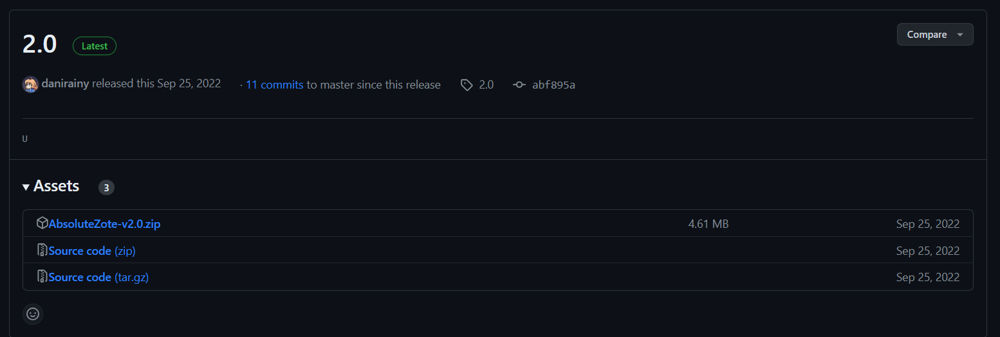

## Then you are required to unpack the archive:
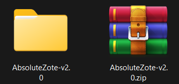

## Then move the folder to the mods of the game:
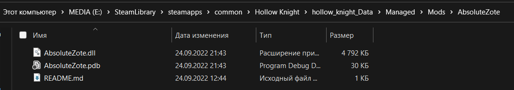

## Launch the game and check that the mod is visible in the game:
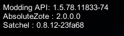

# How the mod works in the game
## First Bretta's basement with Zote's statue:
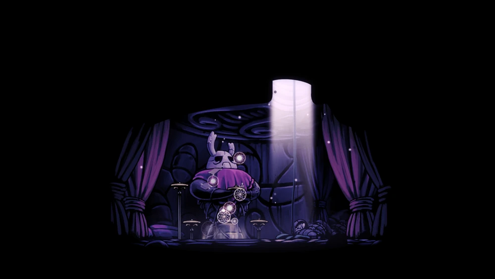

## Then thing we need to do is find Godseeker:
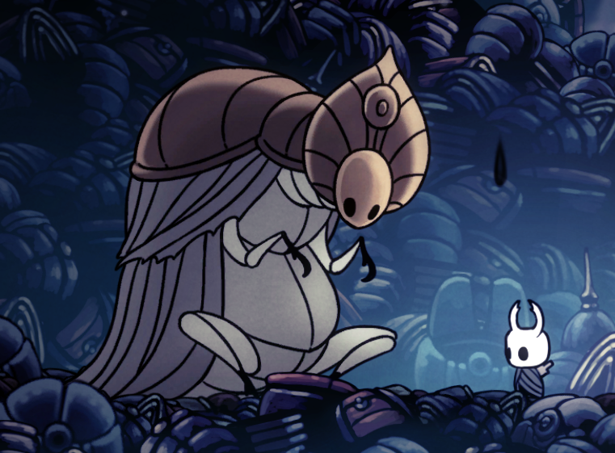

## After, in the hall of the gods find Zote:
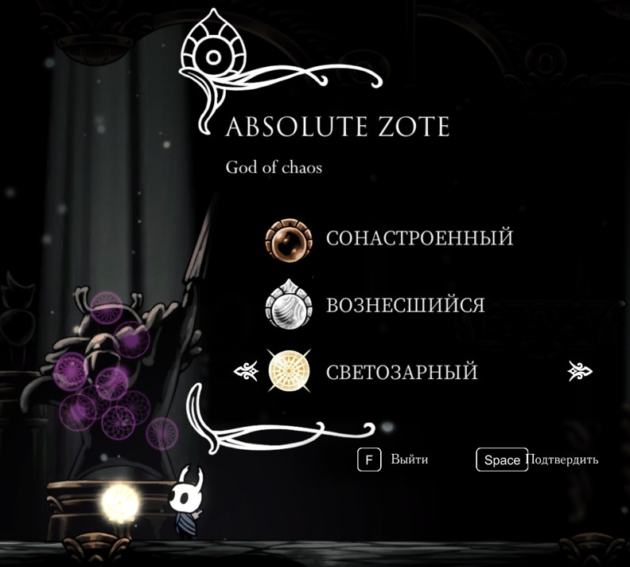

## Enjoying the mod:
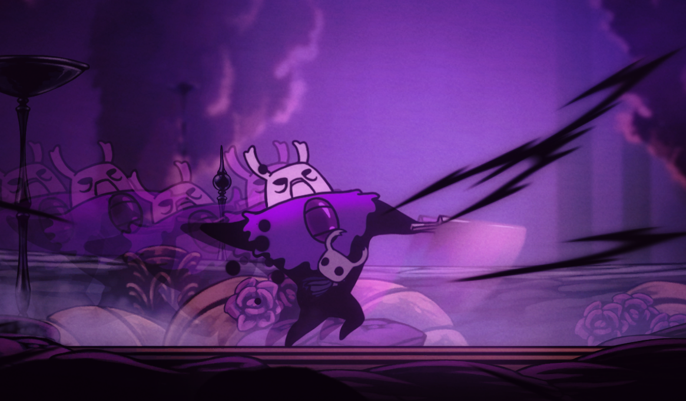

# Changes in the game mode
## Through the game itself:

# Changing settings on file:
## You need to go to the folder:
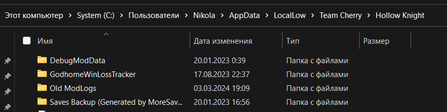

## Change the settings file to suit your requirements:
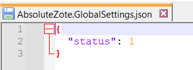

## Example of new settings:
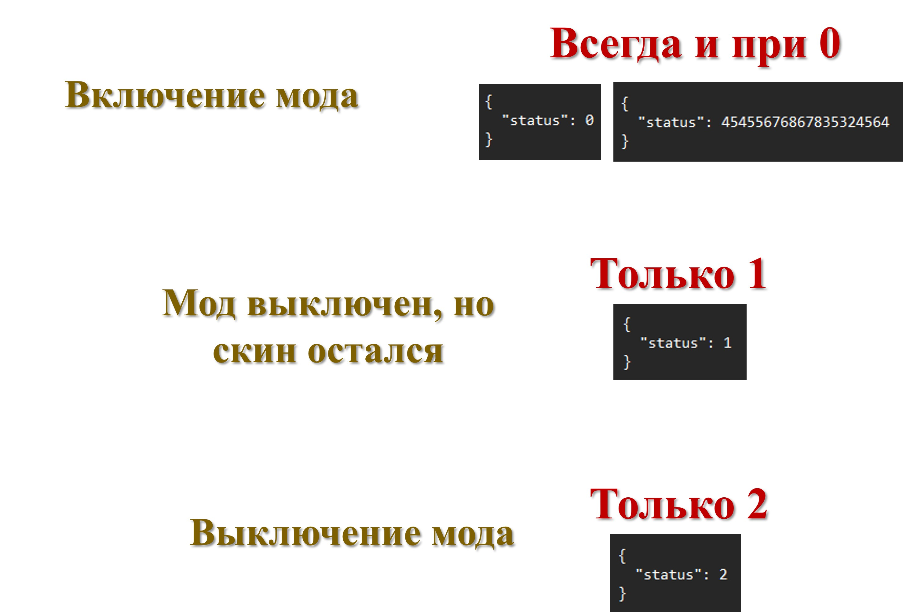

# Dependencies (must install)
[Satchel](https://github.com/PrashantMohta/Satchel/) - a library for creating mods.

## First download the latest mod repository:
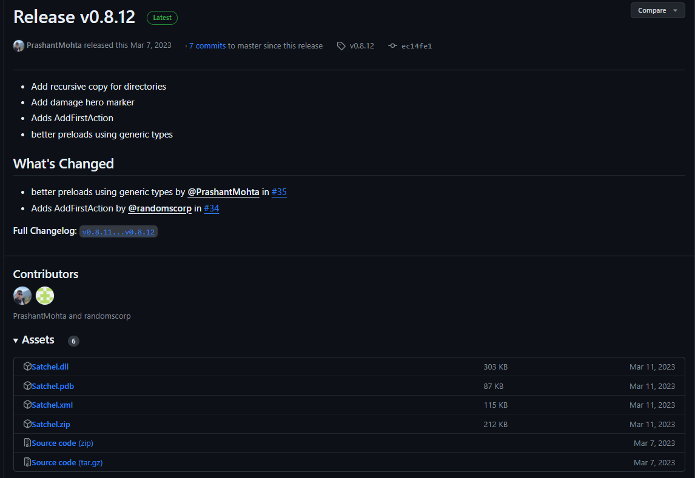

## Then you are required to unpack the archive:
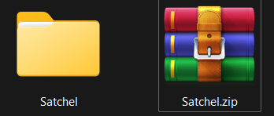

## Then move the folder to the mods of the game:
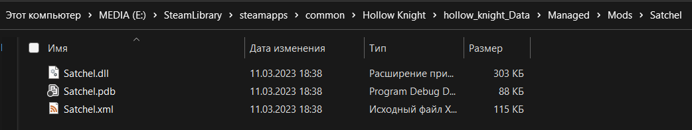